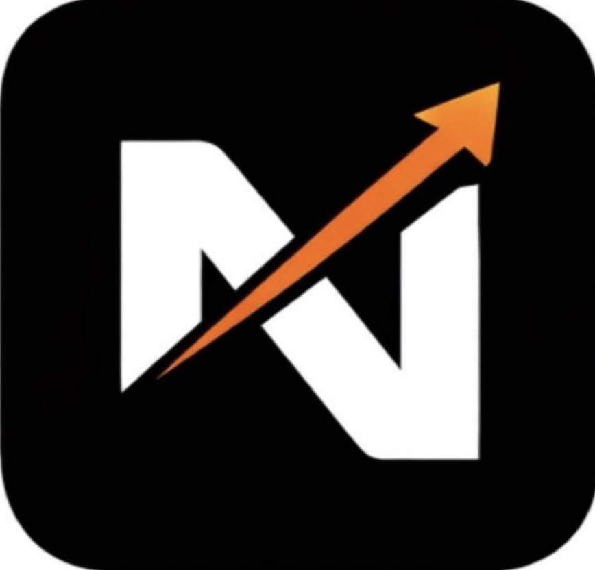
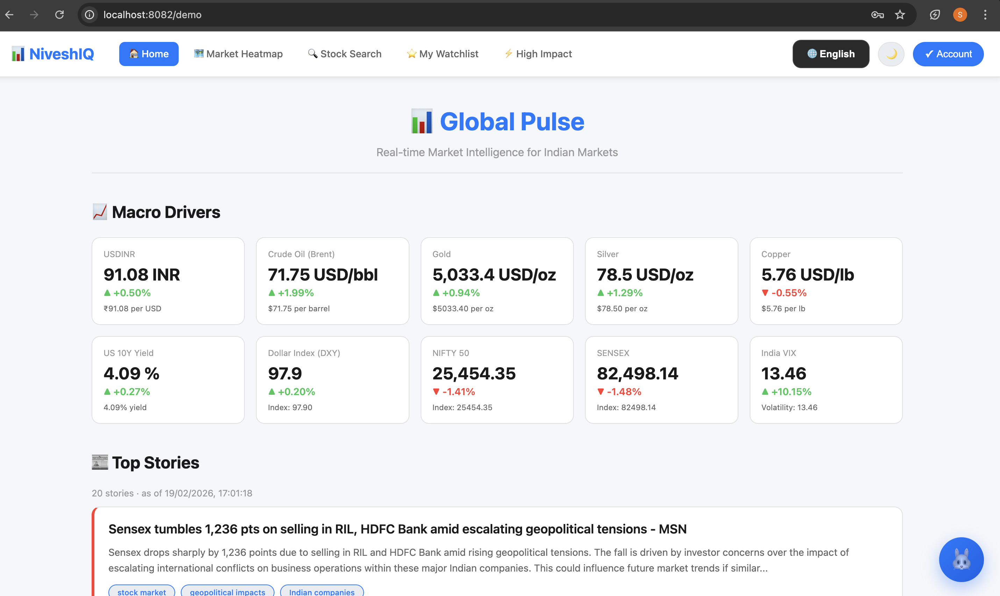
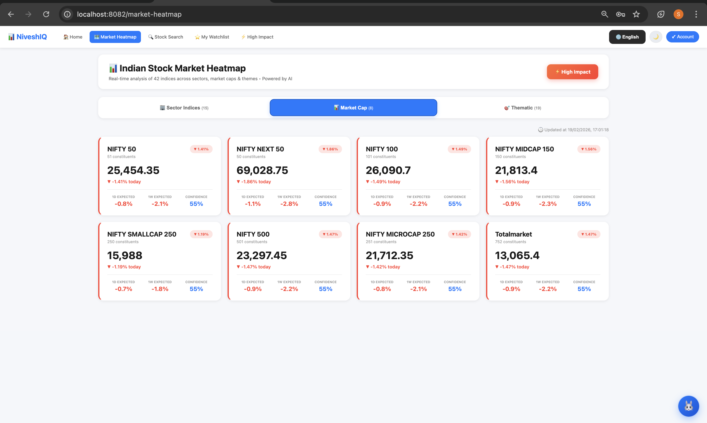
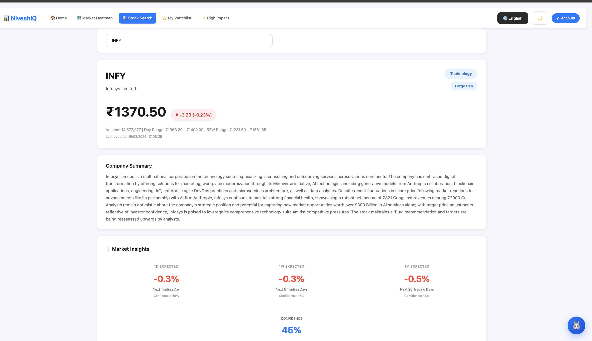
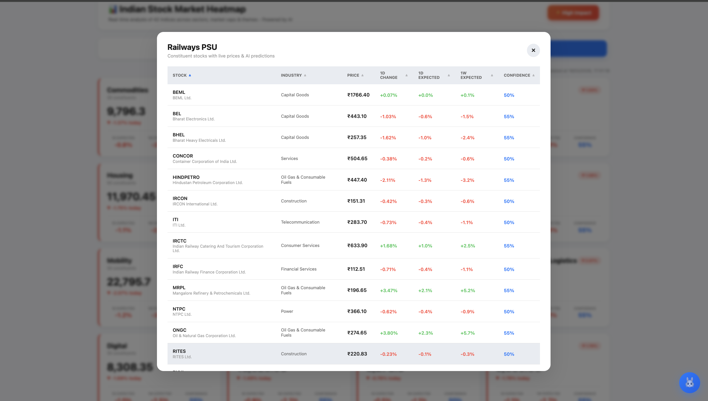

  

# NiveshIQ — AI Market Intelligence for Indian Stocks (NSE)

Turns real-time market news + price data into simplified explanations and **expected-move signals (1D/1W/1M)** for **retail investors and students**.

> **Disclaimer:** NiveshIQ is for educational purposes only and does not constitute investment advice. AI can make errors; users should use their discretion before trading or investing.

---

## What is NiveshIQ?

**NiveshIQ** is a market intelligence platform purpose-built for the **Indian stock market (NSE)**. It helps users answer:

- **Why did this stock/sector move today?**
- **What might move next — and why?**
- **What is the expected move (1D/1W/1M) with confidence?**

Instead of raw headlines, NiveshIQ produces **structured insights**, **impact classification**, and **easy-to-understand reasons**.

---

## The Problem

Retail investors often struggle to:

- Interpret financial news quickly  
- Connect macro events (crude, USD/INR, yields) to sectors/stocks  
- Understand whether a headline is **material** or noise  
- Quantify possible impact and react in time  

Most end up relying on social media tips, delayed analysis, or fragmented tools.

---

## The Solution

NiveshIQ combines:

- **Real-time news ingestion** (RSS + headline sources)
- **Fast sentiment scoring** (FinBERT)
- **LLM-based reasoning + structuring** (Ollama / cloud LLMs)
- **Multi-factor expected-move model**
- **Web + Mobile UX** with heatmaps, dashboards, and watchlists

---

## Key Capabilities

- Tracks **~750+ NSE stocks** (Nifty Total Market universe)  
- Heatmaps across **sectors, market-cap, and themes** (42 indices)  
- **High Impact dashboard**: top gainers/losers, expected movers, volume spikes  
- **Stock deep-dive page**: news, signals, explanations, confidence  
- Personal **watchlist** with alerts-ready structure  
- AI market assistant chat for user questions  
- Multi-language UI (11 Indian languages)  

---

## Product Screens

  
  

  
  
  

> Tip: If you create a short demo video (30–60s), add it here as a “Demo” link for AWS Activate reviewers.

---

## How It Works (High-Level)

### Data + AI Pipeline

1. **Ingest news** (RSS / headlines) and **deduplicate**  
2. **FinBERT** scores sentiment (positive/neutral/negative)  
3. **LLM** generates structured output:
   - symbols/entities  
   - topics  
   - impact level (high/medium/low)  
   - short reasoning summary  
4. Merge with market data and calculate:
   - trend + momentum  
   - sentiment windows  
   - volatility normalization  
5. Publish to dashboards/stock pages with caching for fast load  

### Performance Principle (for fast loading)
- **AI and ingestion run in background jobs**
- APIs serve **precomputed results** from DB/cache  
This avoids doing heavy AI work on page load.

---

## Expected Move (Model Summary)

NiveshIQ uses a multi-factor model to estimate **expected move** and confidence.

Example factors:
- Momentum  
- Trend  
- Short-term sentiment (24h)  
- Medium-term sentiment (7d)  
- Volatility normalization  

Outputs are capped to avoid extreme values and are presented as:
- **1D / 1W / 1M expected move**
- **confidence**
- **plain-English explanation**

---

## Planned AWS Deployment (for AWS Activate)

NiveshIQ needs scalable, reliable infrastructure for:
- Continuous ingestion + scheduled pipelines  
- AI processing workloads (batch + near-real-time)  
- Low-latency APIs for web and mobile  
- Secure user authentication and data storage  
- Monitoring and cost control  

### AWS Services (Planned)
- **Amazon ECS (or EC2)** — API + worker services  
- **Amazon RDS (PostgreSQL)** — production DB for news, tags, rollups, users  
- **Amazon ElastiCache (Redis)** — caching hot endpoints (heatmaps, stock pages)  
- **Amazon S3** — raw news archives, model artifacts, static assets/screenshots  
- **AWS Lambda** — lightweight background jobs (scheduled tasks, triggers)  
- **Amazon CloudWatch** — logs, alarms, monitoring  
- **API Gateway / ALB** — routing and security controls  

### Social Feed add-on (planned on AWS)
- **S3 + CloudFront** for media (images/videos)
- **RDS + Redis** for posts/comments/likes + trending ranking
- Optional: **Amazon Cognito** for user authentication

---

## Current Stage

- Prototype and core pipelines implemented (news ingestion + AI tagging + dashboards)  
- Web dashboard working in development  
- Mobile app in progress  
- Preparing for beta launch and early user onboarding  

---

## Roadmap

### Near-term (0–2 months)
- Portfolio tracking and P&L analytics  
- Better onboarding and personalization  
- Push notifications for watchlist (news + signal triggers)  
- Improve caching + precomputed rollups for faster stock/global pulse pages

### Next (2–4 months)
- Real-time price updates (WebSockets)  
- Options / implied volatility overlays  
- Broker integrations (order-routing optional)  
- Backtesting + model calibration  

---

## Community Roadmap: Financial Social Feed

Goal: make NiveshIQ a **financial social app** where users learn markets through **news-driven discussions, memes, and short videos** — targeting **retail investors + students**.

### Phase 1 (MVP): Channels + Posts + Comments
- Create/join **Channels** (e.g., #Nifty, #BankNifty, #IPOs, #LongTerm, #Beginner, #Memes)
- Post **text / image / video** with optional tags: `stock`, `sector`, `theme`, `news-link`
- **Like / comment / reply threads**
- Sort: **Trending / Latest / Top (24h / 7d)**
- Basic moderation: report, block, remove post (admin/mod roles)

### Phase 2: News → Social loop + Safety
- Auto-generate “Top Stories” post per channel (from Global Pulse)
- Meme/video generation workflow (human review first)
- Reputation/karma + badges (Beginner, Analyst, Trader)
- Anti-spam + rate limits + toxicity filter + duplicate detection

### Phase 3: Growth + Monetization (optional)
- Premium/private channels
- Clearly-labeled sponsored learning series
- Creator tools + analytics
- Verified expert Q&A sessions

---

## Repository Note (Public README)

This repository is a **public product overview** for demos, architecture, and AWS Activate evaluation.  
The production source code is maintained separately in a private repository.

---

## Founder / Co-Founder

- **Nitin Agarwal** — Investment Banking  
- **Sanskriti Garg** — DevOps + AI systems engineering; scalable pipelines, deployment automation, production-ready infra  

---

## Contact

- Email: sanskritigarg31@gmail.com  
- LinkedIn: https://www.linkedin.com/in/sanskriti-garg-0407  
